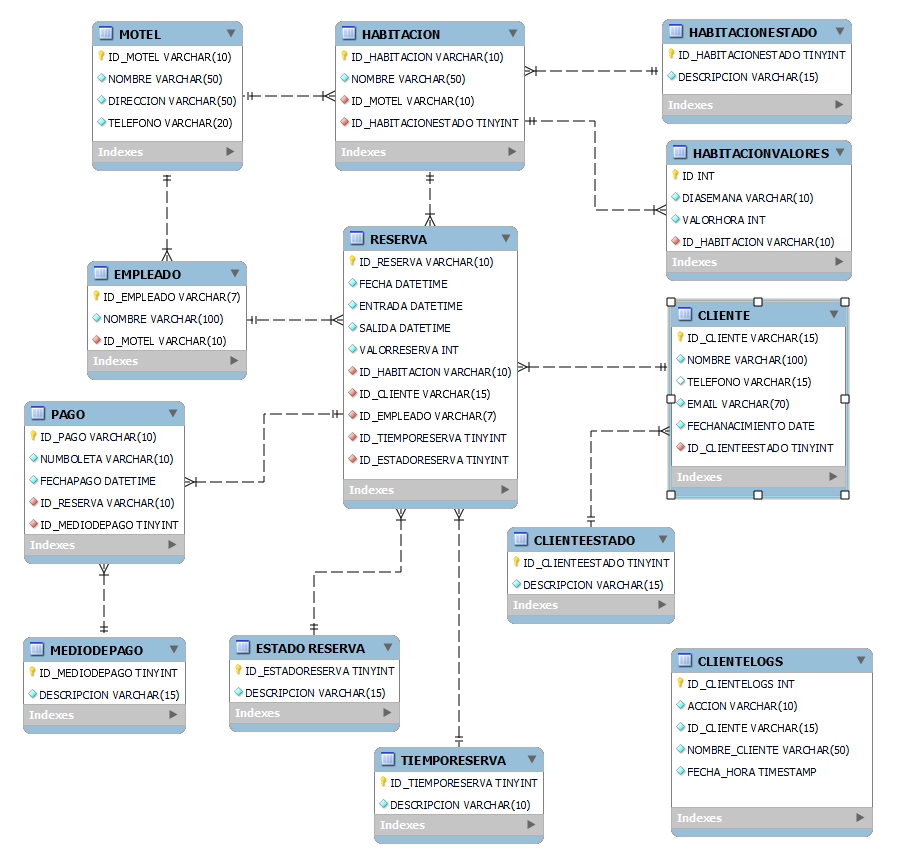
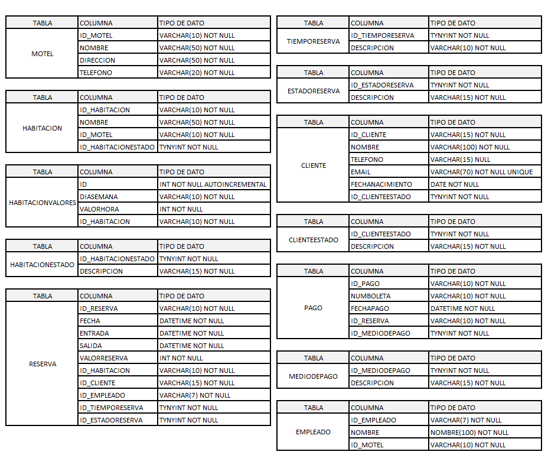

<center>

</center>


# <center>Entrega de proyecto final</center>
Alumno  : Jorge Jara

Comisión    : 53175

Tutor  : Jonatan Canchi

Docente    : Michel Anderson


---

### **Consignas:**
- La base de datos debe contener al menos:
    * ~ 15 tablas, entre las cuales debe haber al menos 1 tabla de hechos,  2 tablas transaccionales.
    * ~ 5 vistas.
    * ~ 2 stored procedure.
    * ~ 2  trigger.
    * ~ 2 funciones
    
- El documento debe contener:
    - Introducción
    - Objetivo
    - Situación problemática
    - Modelo de negocio
    - Diagrama de entidad relació
    - Listado de tablas con descripción de estructura (columna,descripción, tipo de datos, tipo de clave)
    - Scripts de creación de cada objeto de la base de datos
    - Scripts de inserción de datos
    - Informes generados en base a la información de la base
    - Herramientas y tecnologías usadas


---

## Tematica del proyecto
Nuestro equipo de desarrollo está trabajando en un sistema de gestión de reservas para restaurantes, y nos enfrentamos a la necesidad de diseñar una base de datos eficiente que pueda manejar todas las operaciones relacionadas con las reservas de manera óptima.
## Modelo de negocio

1. **Gestión de Clientes y Empleados**: Necesitamos una base de datos que nos permita registrar la información de los clientes que realizan reservas, así como de los empleados involucrados en el proceso de reserva, como los camareros o encargados de atención al cliente.

2. **Gestión de Tipos de Reserva**: Es importante poder clasificar las reservas según su tipo, ya sea una reserva estándar, una reserva para eventos especiales o reservas de grupos grandes. Esto nos ayudará a organizar mejor el flujo de trabajo y adaptar nuestros servicios según las necesidades del cliente.

3. **Gestión de Mesas y Disponibilidad**: La base de datos debe permitirnos registrar la disponibilidad de mesas en cada restaurante, así como gestionar su capacidad y estado (ocupado o disponible). Esto es fundamental para garantizar una asignación eficiente de mesas y evitar conflictos de reservas.

4. **Registro de Reservas**: Necesitamos un sistema que pueda registrar de manera detallada cada reserva realizada, incluyendo la fecha y hora de la reserva, el cliente que la realizó, la mesa reservada, el empleado que atendió la reserva y el tipo de reserva.


## Diagrama entidad relación (DER)

<center>

</center>

## Listado de tablas y descripción

<center>

</center>

## Estructura e ingesta de datos
* La estructura se realiza por medio del archivo database_structure.sql.
* La ingesta de datos se realiza por medio del archivo population.sql


## Objetos de la base de datos

### Documentacion de Vistas


### Vista: ClientesDeCumpleañosMesActual

**Descripción:** Listado de clientes vigentes que se encuentran de cumpleaños en el mes en curso.

**Columnas:**

* **NOMBRE:** Nombre del cliente
* **EMAIL:** Email del cliente
* **FECHANACIMIENTO:** Fecha de nacimiento del cliente
* **DESCRIPCION:** Estado del cliente (solo clientes activos)

**Ejemplo de consulta:**

```sql
SELECT * FROM ClientesDeCumpleanosMesActual;
```

### Vista: ClientesTopReservasAnual 

**Descripción:** Listado de 3 clientes con mayor cantidad de reservaciones en el año en cualquiera de los moteles del sistema.

**Columnas:**

* **ID_CLIENTE:** Id del cliente
* **NUMEROVISITAS:** Número de visitas del cliente en el año
* **NOMBRE:** Nombre del cliente
* **EMAIL:** Email del cliente
* **DESCRIPCION:** Estado del cliente (solo clientes activos)

**Ejemplo de consulta:**

```sql
SELECT * FROM ClientesTopReservasAnual;
```


## Documentación de Funciones

### Función: TotalPagosCliente

**Descripción:** Retorna el valor total de pagos recibidos por concepto de reservas de motel para un cliente especifico.

**Parámetros:**

* **CLIENTE_ID:** Identificador del cliente

**Retorno:**

* Cantidad de dinero pagada por concepto de reservas del cliente

**Ejemplo de uso:**

```sql
SELECT TotalPagosCliente('CLI005');
```


### Función: ObtenerNombreCliente

**Descripción:** Retorna el nombre del cliente asociado a una reserva especifica.

**Parámetros:**

* **ID_RESERVA:** Número identificador de la reserva

**Retorno:**

* Nombre del cliente vinculado a la reserva

**Ejemplo de uso:**

```sql
SELECT ObtenerNombreCliente('RES5792586');
```


## Documentación de Triggers

### Trigger: after_insert_trigger

**Descripción:** Este trigger registra la inserción de un nuevo cliente en la tabla LOG_CAMBIOS.

**Detalles:**

* **Tabla afectada:** CLIENTE
* **Acción:** INSERT
* **Información registrada:** Fecha, ID del cliente, Usuario

**Ejemplo:**

* Se inserta un nuevo cliente.
* El trigger registra la acción en la tabla LOG_CAMBIOS con los detalles correspondientes.

### Trigger: after_update_cancelacion_trigger

**Descripción:** Este trigger registra la cancelación de una reserva en la tabla LOG_CAMBIOS.

**Detalles:**

* **Tabla afectada:** RESERVA
* **Acción:** CANCELACION
* **Información registrada:** Fecha, ID del cliente (si se conoce), Usuario

**Ejemplo:**

* Se actualiza una reserva para indicar su cancelación.
* Si la cancelación no estaba presente antes, el trigger registra la acción en la tabla LOG_CAMBIOS.

### Trigger: before_insert_cliente_trigger

**Descripción:** Este trigger verifica si el correo electrónico de un nuevo cliente ya está en uso.

**Detalles:**

* **Tabla afectada:** CLIENTE
* **Acción:** INSERT
* **Validación:** Correo electrónico único

**Ejemplo:**

* Se intenta insertar un nuevo cliente con un correo electrónico ya registrado.
* El trigger genera un error y la inserción no se realiza.

### Trigger: before_insert_reserva_trigger

**Descripción:** Este trigger verifica si un cliente ya tiene una reserva en la misma hora y mesa.

**Detalles:**

* **Tabla afectada:** RESERVA
* **Acción:** INSERT
* **Validación:** No se permiten reservas duplicadas en la misma hora y mesa para un mismo cliente.

**Ejemplo:**

* Se intenta reservar una mesa para un cliente que ya tiene una reserva en la misma hora y mesa.
* El trigger genera un error y la reserva no se realiza.


## Documentación de Procedimientos Almacenados

### Procedimiento: actualizar_reserva_cancelada_por_email

**Descripción:** Este procedimiento actualiza una reserva cancelada para un cliente a partir de su correo electrónico.

**Parámetros:**

* **p_email:** Correo electrónico del cliente

**Retorno:**

* Mensaje de éxito o error

**Ejemplo de uso:**

```sql
CALL actualizar_reserva_cancelada_por_email('ejemplo@correo.com');
```

### Procedimiento: actualizar_tipo_reserva_por_email

**Descripción:** Este procedimiento actualiza el tipo de reserva de la última reserva realizada por un cliente a partir de su correo electrónico.

**Parámetros:**

* **p_email:** Correo electrónico del cliente
* **p_nuevo_tipo:** Nuevo tipo de reserva

**Retorno:**

* Mensaje de éxito o error

**Ejemplo de uso:**

```sql
CALL actualizar_tipo_reserva_por_email('ejemplo@correo.com', 'Reserva de Grupo');
```

### Procedimiento: crear_empleado

**Descripción:** Este procedimiento crea un nuevo empleado en la base de datos.

**Parámetros:**

* **p_nombre:** Nombre del empleado
* **p_telefono:** Teléfono del empleado
* **p_correo:** Correo electrónico del empleado
* **p_id_restaurante:** Identificador del restaurante al que pertenece el empleado

**Retorno:**

* Mensaje de éxito o error

**Ejemplo de uso:**

```sql
CALL crear_empleado('Juan Pérez', '123456789', 'juan.perez@ejemplo.com', 1);
```

## Roles y permisos
`./objects/roles_users.sql`

Se genera tres roles:

1. `role_select_vistas`: Este rol tiene permisos solo para SELECT en las vistas.
2. `role_crud_restaurantes`: Este rol tiene permisos para generar CRUD en las tablas relacionadas con restaurantes.
3. `role_creacion_usuarios`: Este rol tiene permisos para crear y eliminar usuarios.

Además, crea dos usuarios por cada rol y les asigna los roles correspondientes.

## Back up de la base de datos

Se puede generar un comando en el archivo `make backup` que me permite ejecutar un backup de manera manual.

## Herramientas y tecnologias usadas
* Makefile (para generar una interfaz sencilla de procesos)
* Docker (para generar un container)
* MySQL (Motor de bases de datos `version: latest`)
* MySQL Workbench (Interfaz grafica)
* Mockaroo (para otorgar datos ficticios)

## Como levantar el proyecto en CodeSpaces GitHub
* env: Archivo con contraseñas y data secretas
* Makefile: Abstracción de creacción del proyecto
* docker-compose.yml: Permite generar las bases de datos en forma de contenedores

#### Pasos para arrancar el proyecto

* En la terminal de linux escribir :
    - `make` _si te da un error de que no conexion al socket, volver al correr el comando `make`_
    - `make clean-db` limpiar la base de datos
    - `make test-db` para mirar los datos de cada tabla
    - `make backup-db` para realizar un backup de mi base de datos
    - `make access-db` para acceder a la base de datos# SQL_ProyectoFinal
