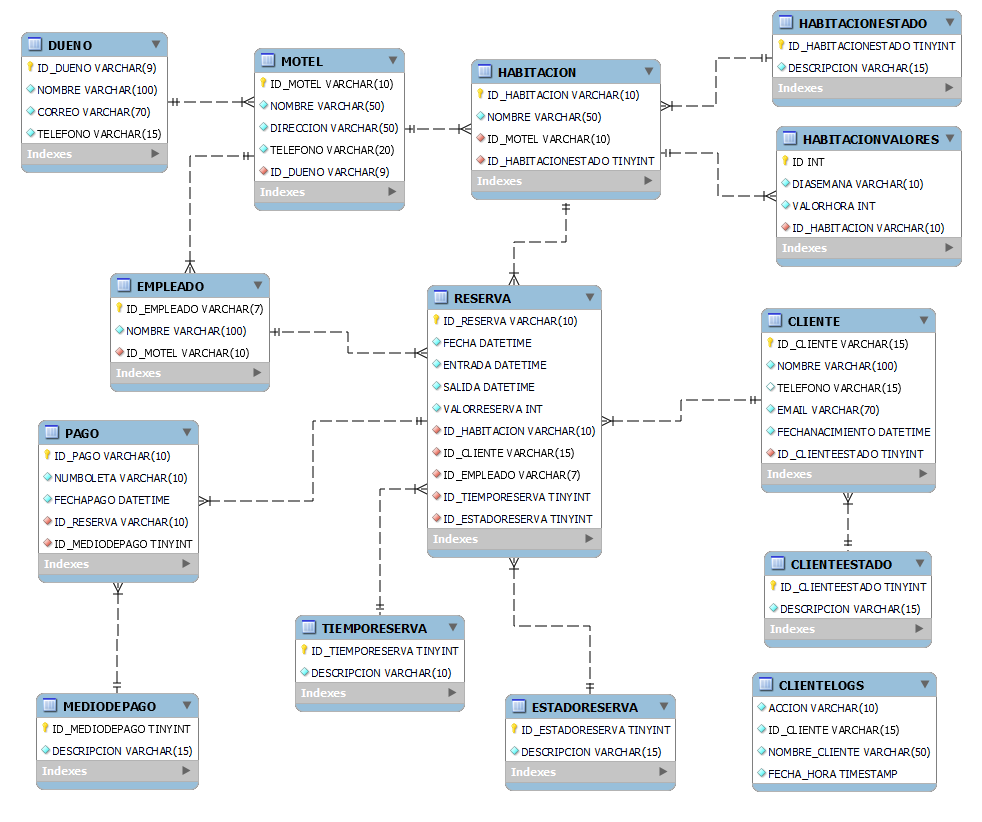

<center>

</center>


# <center>Entrega de proyecto final</center>
Alumno  : Jorge Jara

Comisión    : 53175

Tutor  : Jonatan Canchi

Docente    : Michel Anderson

---

### **Consignas:**
- La base de datos debe contener al menos:
    * ~ 15 tablas, entre las cuales debe haber al menos 1 tabla de hechos,  2 tablas transaccionales.
    * ~ 5 vistas.
    * ~ 2 stored procedure.
    * ~ 2  trigger.
    * ~ 2 funciones
    
- El documento debe contener:
    - Introducción
    - Objetivo
    - Situación problemática
    - Modelo de negocio
    - Diagrama de entidad relació
    - Listado de tablas con descripción de estructura (columna,descripción, tipo de datos, tipo de clave)
    - Scripts de creación de cada objeto de la base de datos
    - Scripts de inserción de datos
    - Informes generados en base a la información de la base
    - Herramientas y tecnologías usadas


---

## Introducción

En el contexto del creciente sector turístico y de hospedaje en la vibrante ciudad de Santiago de Chile, la eficiente gestión de reservas en moteles se ha vuelto fundamental para garantizar una experiencia satisfactoria para los clientes y una operación fluida para los establecimientos. En este proyecto, nos enfocamos en el diseño y modelamiento de una base de datos utilizando MySQL, dirigida específicamente a la gestión de reservas de habitaciones en moteles de Santiago.

## Objetivo

El objetivo principal de este proyecto es desarrollar un sistema de gestión de reservas robusto, que permita a los moteles llevar un registro detallado de las reservas realizadas, disponibilidad de habitaciones, información de clientes y otras variables relevantes para una administración eficiente. Al implementar una base de datos bien estructurada, se busca optimizar procesos, minimizar errores y mejorar la experiencia tanto para los clientes como para el personal encargado de la gestión de reservas.

Para lograr este propósito, se realizará un exhaustivo análisis de los requisitos del sistema, considerando las necesidades específicas de los moteles en cuanto a la gestión de reservas y las características particulares del mercado de hospedaje en Santiago de Chile. A partir de este análisis, se diseñará un modelo de base de datos que refleje de manera precisa la estructura y relaciones entre los diferentes elementos del sistema.

Este proyecto no solo busca ofrecer una solución técnica eficaz, sino también contribuir al desarrollo y modernización del sector de hospedaje en Santiago, promoviendo estándares de calidad y eficiencia que beneficien tanto a los establecimientos como a los visitantes de la ciudad.

## Temática del proyecto

Desarrollo de un sistema gestor de reservas de habitaciones de moteles mediante el modelamiento de una base de datos que permita manejar todas las operaciones relacionadas con las reservas de manera óptima.

## Modelo de negocio

1. **Gestión de Clientes y Empleados**: La base de datos debe permitir registrar la informacion de los clientes que realizan las reservas, asi como del trabador responsable de atender y gestionar la reserva de dicho cliente durante su estancia en el motel.

2. **Gestión de Tiempo de Reserva**: La base de datos debe considerar bloques horarios de reserva (3 y 12 horas a lo menos). Gestionar y calcular de manera adecuada reduce los tiempos muertos y disponibiliza la mayor cantidad de tiempo cada habitación de motel.

3. **Registro de Reservas**: La base de datos debe registrar de manera detallada cada reserva realizada, incluyendo la fecha y hora de la reserva, hora de entrada, hora de salida, el cliente que la realizó, la habitación reservada, el motel al que pertenece dicha habitacion, el empleado que atendió la reserva, el tipo de reserva, su duración y su valor.

4. **Registro de Pagos**: La base de datos debe registrar el pago de cada reserva de manera detallada, incluyendo la fecha, el identificador de la reserva, el medio de pago y su valor.


## Diagrama entidad relación (DER)


<center>

</center>

## Listado de tablas y descripción

<center>

</center>

## Estructura e ingesta de datos
* La estructura se realiza por medio del archivo database_structure.sql.
* La ingesta de datos se realiza por medio del archivo population.sql


## Objetos de la base de datos

### Documentacion de Vistas


### Vista: ClientesDeCumpleañosMesActual

**Descripción:** Listado de clientes vigentes que se encuentran de cumpleaños en el mes en curso.

**Columnas:**

* **NOMBRE:** Nombre del cliente
* **EMAIL:** Email del cliente
* **FECHANACIMIENTO:** Fecha de nacimiento del cliente
* **DESCRIPCION:** Estado del cliente (solo clientes activos)

**Ejemplo de consulta:**

```sql
SELECT * FROM ClientesDeCumpleanosMesActual;
```

### Vista: ClientesTopReservasAnual 

**Descripción:** Listado de 3 clientes con mayor cantidad de reservaciones en el año en cualquiera de los moteles del sistema.

**Columnas:**

* **ID_CLIENTE:** Id del cliente
* **NUMEROVISITAS:** Número de visitas del cliente en el año
* **NOMBRE:** Nombre del cliente
* **EMAIL:** Email del cliente
* **DESCRIPCION:** Estado del cliente (solo clientes activos)

**Ejemplo de consulta:**

```sql
SELECT * FROM ClientesTopReservasAnual;
```

## Documentación de Funciones

### Función: TotalPagosCliente

**Descripción:** Retorna el valor total de pagos recibidos por concepto de reservas de motel para un cliente especifico.

**Parámetros:**

* **CLIENTE_ID:** Identificador del cliente

**Retorno:**

* Cantidad de dinero pagada por concepto de reservas del cliente

**Ejemplo de uso:**

```sql
SELECT TotalPagosCliente('CLI005');
```

### Función: ObtenerNombreCliente

**Descripción:** Retorna el nombre del cliente asociado a una reserva especifica.

**Parámetros:**

* **ID_RESERVA:** Número identificador de la reserva

**Retorno:**

* Nombre del cliente vinculado a la reserva

**Ejemplo de uso:**

```sql
SELECT ObtenerNombreCliente('RES5792586');
```

## Documentación de Triggers

### Trigger: trigger_cliente_insert

**Descripción:** Este trigger registra la inserción de un nuevo cliente en la tabla CLIENTE

**Detalles:**

* **Tabla afectada:** CLIENTELOGS
* **Acción:** INSERT
* **Información registrada:** ACCION, ID_CLIENTE, NOMBRE_CLIENTE, FECHA_HORA

**Ejemplo:**

* Se inserta un nuevo cliente.
* El trigger registra la acción en la tabla CLIENTELOGS con los detalles correspondientes.

### Trigger: trigger_cliente_update

**Descripción:** Este trigger registra la modificación de un nuevo cliente en la tabla CLIENTE

**Detalles:**

* **Tabla afectada:** CLIENTELOGS
* **Acción:** UPDATE
* **Información registrada:** ACCION, ID_CLIENTE, NOMBRE_CLIENTE, FECHA_HORA

**Ejemplo:**

* Se modifica un cliente.
* El trigger registra la acción en la tabla CLIENTELOGS con los detalles correspondientes.


### Trigger: trigger_cliente_delete

**Descripción:** Este trigger registra la eliminación de un cliente en la tabla CLIENTE

**Detalles:**

* **Tabla afectada:** CLIENTELOGS
* **Acción:** DELETE
* **Información registrada:** ACCION, ID_CLIENTE, NOMBRE_CLIENTE, FECHA_HORA

**Ejemplo:**

* Se elimina un cliente.
* El trigger registra la acción en la tabla CLIENTELOGS con los detalles correspondientes.

## Documentación de Procedimientos Almacenados

### Procedimiento: ReservasAnuladas

**Descripción:** Retorna listado histórico de reservas anuladas.

**Parámetros:**

* No utiliza

**Retorno:**
**Columnas:**

* **ID_CLIENTE:** Id del cliente
* **ID_RESERVA:** Identificador de la reserva
* **VALORRESERVA:** Valor pagado por la reserva
* **FECHA:** Fecha de la reserva
* **NOMBRE_CLIENTE:** Nombre del cliente
* **NOMBRE_HABITACION:** Nombre de la habitación
* **NOMBRE_MOTEL:** Nombre del motel

**Ejemplo de uso:**

```sql
CALL ReservasAnuladas();
```

### Procedimiento: EstadisticaMensualMoteles

**Descripción:** Retorna el número total de reservas efectivas y el monto recaudado por cada motel al mes.

**Parámetros:**

* **RESERVA.FECHA** Hardcodeado a mes = 1 para mostrar resultados contenidos en la DB

**Columnas:**

* **ID_MOTEL:** Identificador del motel
* **NOMBRE:** Nombre del motel
* **CANTIDAD_RESERVAS:** Cantidad de reservas en el mes
* **TOTAL_VALOR_RESERVAS:** Total dinero recaudado por reservas en el mes
* **DESCRIPCION:** Estado de la reserva (solo confirmadas)

**Ejemplo de uso:**

```sql
CALL EstadisticaMensualMoteles();
```


## Roles y permisos
`./objects/roles_users.sql`

Se genera dos roles:

1. `role_select_vistas`: Este rol tiene permisos solo para SELECT en las vistas.
2. `role_crud_moteles`: Este rol tiene permisos para generar CRUD en las tablas relacionadas con moteles.

Crea un usuario por cada rol y le asigna los roles correspondientes.

## Backup de la base de datos

Se puede generar un respaldo en el directorio backup con el comando `make backup-db`.

## Herramientas y tecnologías usadas
* Makefile (para generar una interfaz sencilla de procesos).
* Docker (para generar un container).
* MySQL (Motor de bases de datos `version: latest`).
* MySQL Workbench (Interfaz gráfica).

## Como levantar el proyecto en CodeSpaces GitHub
* env: Archivo con contraseñas y data secretas.
* Makefile: Abstracción de creacción del proyecto.
* docker-compose.yml: Permite generar las bases de datos en forma de contenedores.

#### Pasos para arrancar el proyecto

* En la terminal de linux escribir :
    - `make` _si te da un error de que no conexion al socket, volver al correr el comando `make`_
    - `make clean-db` para limpiar la base de datos.
    - `make test-db` para mirar los datos de cada tabla.
    - `make backup-db` para realizar un backup de la base de datos.
    - `make access-db` para acceder a la base de datos mediante un instancia de terminal de mysql.
