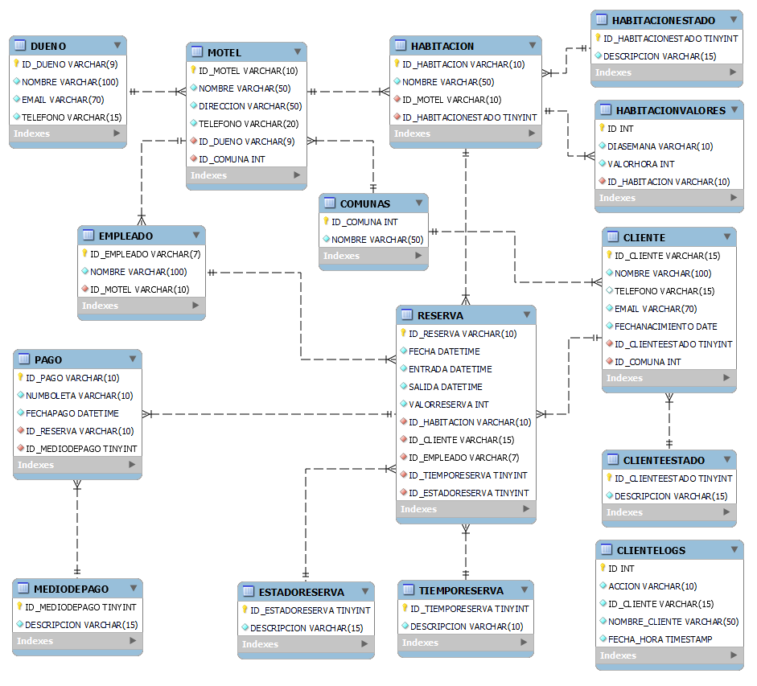
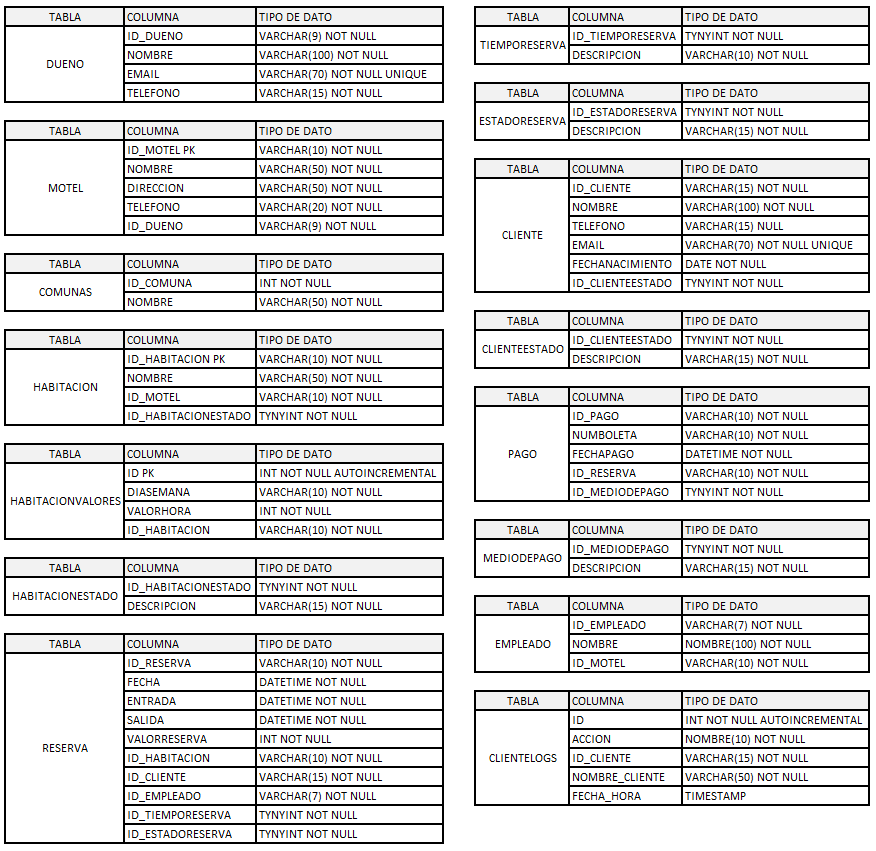

<center>

</center>


# <center>Entrega de proyecto final</center>
Alumno  : Jorge Jara

Comisión    : 53175

Tutor  : Jonatan Canchi

Docente    : Michel Anderson


---

### **Consignas:**
- La base de datos debe contener al menos:
    * ~ 15 tablas, entre las cuales debe haber al menos 1 tabla de hechos,  2 tablas transaccionales.
    * ~ 5 vistas.
    * ~ 2 stored procedure.
    * ~ 2  trigger.
    * ~ 2 funciones
    
- El documento debe contener:
    - Introducción
    - Objetivo
    - Situación problemática
    - Modelo de negocio
    - Diagrama de entidad relació
    - Listado de tablas con descripción de estructura (columna,descripción, tipo de datos, tipo de clave)
    - Scripts de creación de cada objeto de la base de datos
    - Scripts de inserción de datos
    - Informes generados en base a la información de la base
    - Herramientas y tecnologías usadas


---

## Tematica del proyecto

Desarrollo de un sistema gestor de reservas de habitaciones de moteles mediante el modelamiento de una base de datos eficiente que permita manejar todas las operaciones relacionadas con las reservas de manera óptima.

## Modelo de negocio

1. **Gestión de Clientes y Empleados**: La base de datos debe permitir registrar la informacion de los clientes que realizan las reservas, asi como del trabador responsable de atender y gestionar la reserva de dicho cliente durante su estancia en el motel.

2. **Gestión de Tiempo de Reserva**: La base de datos debe considerar bloques horarios de reserva (3 y 12 horas a lo menos). Gestionar y calcular de manera adecuada reduce los tiempos muertos y disponibiliza la mayor cantidad de tiempo posible cada habitación.

3. **Registro de Reservas**: La base de datos debe registrar de manera detallada cada reserva realizada, incluyendo la fecha y hora de la reserva, el cliente que la realizó, la habitación reservada, el motel al que pertenece dicha habitacion, el empleado que atendió la reserva, el tipo de reserva, su duración y su valor.

4. **Registro de Pagos**: La base de datos debe registrar el pago de cada reserva de manera detallada, incluyendo la fecha, el identificador de la reserva, el medio de pago y su valor.


## Diagrama entidad relación (DER)

<center>

</center>

## Listado de tablas y descripción

<center>

</center>

## Estructura e ingesta de datos
* La estructura se realiza por medio del archivo database_structure.sql.
* La ingesta de datos se realiza por medio del archivo population.sql


## Objetos de la base de datos

### Documentacion de Vistas


### Vista: ClientesDeCumpleañosMesActual

**Descripción:** Listado de clientes vigentes que se encuentran de cumpleaños en el mes en curso.

**Columnas:**

* **NOMBRE:** Nombre del cliente
* **EMAIL:** Email del cliente
* **FECHANACIMIENTO:** Fecha de nacimiento del cliente
* **DESCRIPCION:** Estado del cliente (solo clientes activos)

**Ejemplo de consulta:**

```sql
SELECT * FROM ClientesDeCumpleanosMesActual;
```

### Vista: ClientesTopReservasAnual 

**Descripción:** Listado de 3 clientes con mayor cantidad de reservaciones en el año en cualquiera de los moteles del sistema.

**Columnas:**

* **ID_CLIENTE:** Id del cliente
* **NUMEROVISITAS:** Número de visitas del cliente en el año
* **NOMBRE:** Nombre del cliente
* **EMAIL:** Email del cliente
* **DESCRIPCION:** Estado del cliente (solo clientes activos)

**Ejemplo de consulta:**

```sql
SELECT * FROM ClientesTopReservasAnual;
```

## Documentación de Funciones

### Función: TotalPagosCliente

**Descripción:** Retorna el valor total de pagos recibidos por concepto de reservas de motel para un cliente especifico.

**Parámetros:**

* **CLIENTE_ID:** Identificador del cliente

**Retorno:**

* Cantidad de dinero pagada por concepto de reservas del cliente

**Ejemplo de uso:**

```sql
SELECT TotalPagosCliente('CLI005');
```

### Función: ObtenerNombreCliente

**Descripción:** Retorna el nombre del cliente asociado a una reserva especifica.

**Parámetros:**

* **ID_RESERVA:** Número identificador de la reserva

**Retorno:**

* Nombre del cliente vinculado a la reserva

**Ejemplo de uso:**

```sql
SELECT ObtenerNombreCliente('RES5792586');
```

## Documentación de Triggers

### Trigger: trigger_cliente_insert

**Descripción:** Este trigger registra la inserción de un nuevo cliente en la tabla CLIENTE

**Detalles:**

* **Tabla afectada:** CLIENTELOGS
* **Acción:** INSERT
* **Información registrada:** ACCION, ID_CLIENTE, NOMBRE_CLIENTE, FECHA_HORA

**Ejemplo:**

* Se inserta un nuevo cliente.
* El trigger registra la acción en la tabla CLIENTELOGS con los detalles correspondientes.

### Trigger: trigger_cliente_update

**Descripción:** Este trigger registra la modificación de un nuevo cliente en la tabla CLIENTE

**Detalles:**

* **Tabla afectada:** CLIENTELOGS
* **Acción:** UPDATE
* **Información registrada:** ACCION, ID_CLIENTE, NOMBRE_CLIENTE, FECHA_HORA

**Ejemplo:**

* Se modifica un cliente.
* El trigger registra la acción en la tabla CLIENTELOGS con los detalles correspondientes.


### Trigger: trigger_cliente_delete

**Descripción:** Este trigger registra la eliminación de un cliente en la tabla CLIENTE

**Detalles:**

* **Tabla afectada:** CLIENTELOGS
* **Acción:** DELETE
* **Información registrada:** ACCION, ID_CLIENTE, NOMBRE_CLIENTE, FECHA_HORA

**Ejemplo:**

* Se elimina un cliente.
* El trigger registra la acción en la tabla CLIENTELOGS con los detalles correspondientes.

## Documentación de Procedimientos Almacenados

### Procedimiento: ReservasAnuladas

**Descripción:** Retorna listado histórico de reservas anuladas.

**Parámetros:**

* No utiliza

**Retorno:**
**Columnas:**

* **ID_CLIENTE:** Id del cliente
* **ID_RESERVA:** Identificador de la reserva
* **VALORRESERVA:** Valor pagado por la reserva
* **FECHA:** Fecha de la reserva
* **NOMBRE_CLIENTE:** Nombre del cliente
* **NOMBRE_HABITACION:** Nombre de la habitación
* **NOMBRE_MOTEL:** Nombre del motel

**Ejemplo de uso:**

```sql
CALL ReservasAnuladas();
```

### Procedimiento: EstadisticaMensualMoteles

**Descripción:** Retorna el número total de reservas efectivas y el monto recaudado por cada motel al mes.

**Parámetros:**

* **RESERVA.FECHA** Hardcodeado a mes = 1 para mostrar resultados contenidos en la BD

**Columnas:**

* **ID_MOTEL:** Identificador del motel
* **NOMBRE:** Nombre del motel
* **CANTIDAD_REERVAS:** Cantidad de reservas en el mes
* **TOTAL_VALOR_RESERVAS:** Total dinero recaudado por reservas en el mes
* **DESCRIPCION:** Estado de la reserva (solo confirmadas)

**Ejemplo de uso:**

```sql
CALL EstadisticaMensualMoteles();
```


## Roles y permisos
`./objects/roles_users.sql`

Se genera tres roles:

1. `role_select_vistas`: Este rol tiene permisos solo para SELECT en las vistas.
2. `role_crud_restaurantes`: Este rol tiene permisos para generar CRUD en las tablas relacionadas con restaurantes.

Crea un usuario por cada rol y le asigna los roles correspondientes.

## Back up de la base de datos

Se puede generar un comando en el archivo `make backup` que me permite ejecutar un backup de manera manual.

## Herramientas y tecnologias usadas
* Makefile (para generar una interfaz sencilla de procesos)
* Docker (para generar un container)
* MySQL (Motor de bases de datos `version: latest`)
* MySQL Workbench (Interfaz grafica)
* Mockaroo (para otorgar datos ficticios)

## Como levantar el proyecto en CodeSpaces GitHub
* env: Archivo con contraseñas y data secretas
* Makefile: Abstracción de creacción del proyecto
* docker-compose.yml: Permite generar las bases de datos en forma de contenedores

#### Pasos para arrancar el proyecto

* En la terminal de linux escribir :
    - `make` _si te da un error de que no conexion al socket, volver al correr el comando `make`_
    - `make clean-db` limpiar la base de datos
    - `make test-db` para mirar los datos de cada tabla
    - `make backup-db` para realizar un backup de mi base de datos
    - `make access-db` para acceder a la base de datos# SQL_ProyectoFinal
